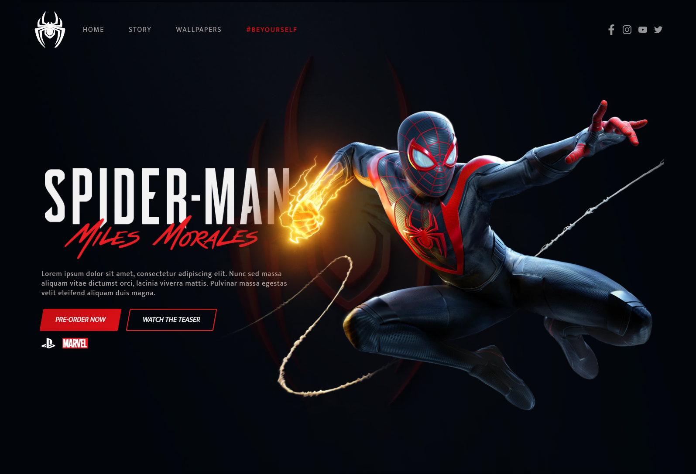

# :spider: Spider-man: Miles Morales | PS5 

Projeto front-end desenvolvido durante o evento FrontWeek, representando o lançamento do jogo Spider-man: Miles Morales.

#### :art: [Clique](https://www.figma.com/file/4U0X1IIJQKOJRT9zuMyxF2/Spider-Man-Rebecca?node-id=0%3A1) para ver o projeto no Figma
## Desktop

## Efeitos
 

## :rocket: Tecnologias
* HTML
* SASS
* JavaScript

## :wrench: Bibliotecas

* GSAP
* SVGInject
* Tilt.js
* JQuery