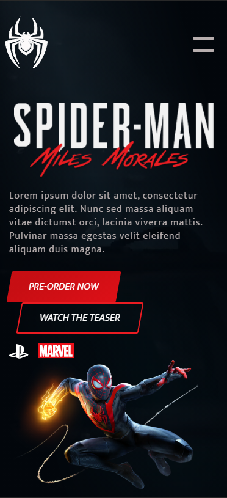

# :spider: Spider-man: Miles Morales | PS5 

Projeto front-end desenvolvido durante o evento FrontWeek, representando o lançamento do jogo Spider-man: Miles Morales.

#### :art: [Clique](https://www.figma.com/file/4U0X1IIJQKOJRT9zuMyxF2/Spider-Man-Rebecca?node-id=0%3A1) para visualizar o projeto no Figma
## Desktop

## Efeitos
 

## Responsivo

## :rocket: Tecnologias
* HTML
* [SASS](https://sass-lang.com/)
* JavaScript
* [GSAP](https://greensock.com/gsap/)
* [SVGInject](https://github.com/iconfu/svg-inject)
* [Tilt.js](https://gijsroge.github.io/tilt.js/)
* [JQuery](https://jquery.com/)